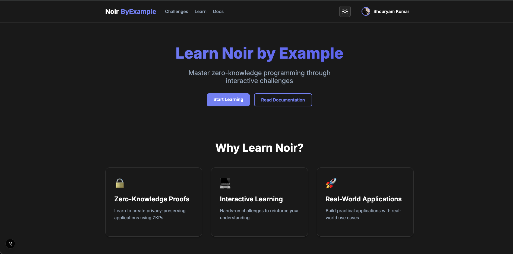

# Noir by Example

An interactive learning platform for Noir, the zero-knowledge proof language. This platform helps developers understand Noir concepts through hands-on coding challenges with real-time feedback.



## Features

- **Interactive Code Editor**: Write and test Noir code directly in your browser
- **Progressive Learning Path**: Challenges designed to gradually build your Noir knowledge
- **Real-time Feedback**: Immediate feedback on your solutions
- **Comprehensive Concepts**: Detailed explanations of Noir concepts with practical examples
- **Responsive Design**: Fully responsive layout that works on desktop and mobile
- **Customizable Interface**: Resize the editor and content areas to your preference
- **Hint System**: Stuck on a challenge? Use the hint system to get unstuck
- **Dark/Light Mode**: Choose your preferred theme for comfortable coding

## Getting Started

### Prerequisites

- Node.js (v16 or later)
- npm or yarn

### Installation

1. Clone the repository:
   ```
   git clone https://github.com/yourusername/noir-by-example.git
   cd noir-by-example
   ```

2. Install dependencies:
   ```
   npm install
   # or
   yarn install
   ```

3. Start the development server:
   ```
   npm run dev
   # or
   yarn dev
   ```

4. Open [http://localhost:3000](http://localhost:3000) in your browser.

## Challenge Structure

Each challenge in Noir by Example follows this structure:

- **Title and Description**: A brief overview of what you'll learn
- **Difficulty Level**: Beginner, Intermediate, or Advanced
- **Challenge Details**: Specific requirements and goals
- **Key Concepts**: Detailed explanations of the Noir concepts used in the challenge
- **Examples**: Input/output examples to understand the expected behavior
- **Editor**: Write your solution here
- **Hints**: Progressive hints if you get stuck
- **Solution**: Reference solution you can reveal when needed

## Contributing

We welcome contributions to Noir by Example! Here's how you can help:

1. **Add New Challenges**: Create new challenges that cover additional Noir concepts
2. **Improve Explanations**: Enhance the concept explanations to make them clearer
3. **Fix Bugs**: Help us fix issues in the platform
4. **Enhance UI/UX**: Improve the user interface and experience

To contribute:

1. Fork the repository
2. Create your feature branch (`git checkout -b feature/amazing-feature`)
3. Commit your changes (`git commit -m 'Add some amazing feature'`)
4. Push to the branch (`git push origin feature/amazing-feature`)
5. Open a Pull Request

## Project Structure

```
noir-by-example/
├── public/           # Static assets
├── src/              # Source code
│   ├── app/          # Next.js app directory
│   │   ├── challenges/  # Challenge pages
│   │   ├── page.tsx     # Homepage
│   │   └── ...
│   ├── components/   # React components
│   ├── contexts/     # React contexts
│   ├── data/         # Challenge data
│   ├── styles/       # Global styles
│   └── ...
├── .gitignore        # Git ignore file
├── next.config.js    # Next.js configuration
├── package.json      # Dependencies and scripts
├── README.md         # This file
└── tsconfig.json     # TypeScript configuration
```

## Technologies Used

- **Next.js**: React framework for the frontend
- **TypeScript**: Type-safe JavaScript
- **Monaco Editor**: Code editor used in VS Code
- **TailwindCSS**: Utility-first CSS framework
- **next-auth**: Authentication for Next.js

## License

This project is licensed under the MIT License - see the LICENSE file for details.

## Acknowledgments

- [Aztec Network](https://aztec.network/) for creating Noir
- [Noir Documentation](https://noir-lang.org/) for references and examples
- All contributors who have helped improve this learning platform 